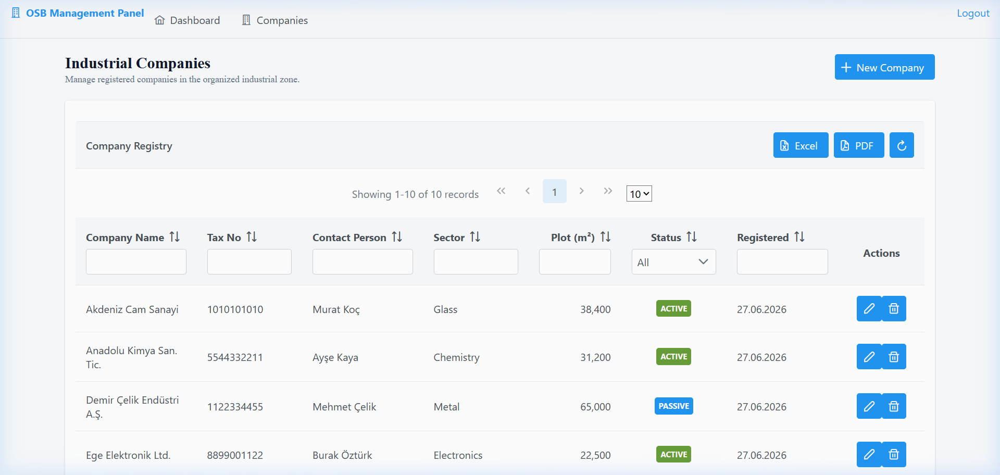
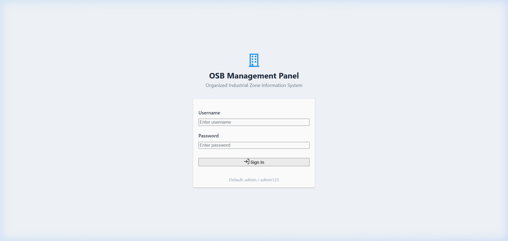
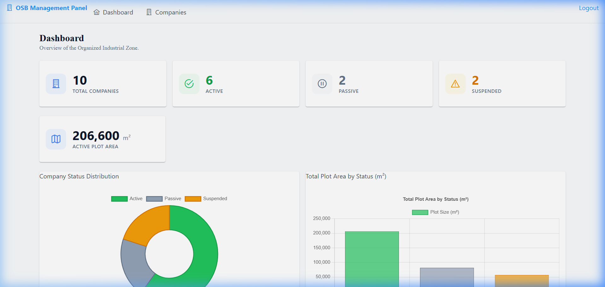

# OSB Management Panel

Organize Sanayi Bölgesi (OSB) yönetim bilgi sistemi.  
Spring Boot 3, Jakarta Faces 4 (JSF) ve PrimeFaces 14 ile geliştirilmiş kurumsal düzeyde bir web uygulamasıdır.



---

## Özellikler

- **Şirket Yönetimi (CRUD)** — Dialog tabanlı yeni kayıt oluşturma, düzenleme ve silme
- **Gelişmiş DataTable** — Çoklu kolon filtreleme, sıralama ve sayfalama
- **Excel & PDF Export** — Tek tıkla `.xlsx` ve `.pdf` dosya indirme
- **İnteraktif Dashboard** — Donut ve bar grafikleri ile KPI kartları
- **Rol Tabanlı Kimlik Doğrulama** — Spring Security ile güvenli giriş sistemi
- **Responsive Tasarım** — Farklı ekran boyutlarına uyumlu arayüz
- **H2 Console** — Geliştirme ortamında doğrudan veritabanı erişimi

---

## Teknoloji Yığını

| Katman | Teknoloji | Versiyon |
|---|---|---|
| Dil | Java | 21 |
| Framework | Spring Boot | 3.3.5 |
| View | Jakarta Faces (JSF) | 4.0 |
| UI Bileşenleri | PrimeFaces | 14.0.0 |
| JSF–Spring Köprüsü | JoinFaces | 5.3.0 |
| ORM | Spring Data JPA + Hibernate | (Boot tarafından yönetilir) |
| Veritabanı | H2 (in-memory) | (Boot tarafından yönetilir) |
| Güvenlik | Spring Security | 6.x |
| Excel Export | Apache POI | 5.3.0 |
| PDF Export | OpenPDF | 2.0.3 |
| Build | Maven | 3.8+ |

---

## Gereksinimler

- **JDK 21** veya üstü
- **Maven 3.8+**
- Git (opsiyonel)

> **Not:** Veritabanı kurulumu gerekmez. Uygulama H2 in-memory veritabanı kullanır ve her başlatmada 10 adet demo kayıt otomatik olarak yüklenir.

---

## Kurulum & Çalıştırma

### 1. Projeyi klonlayın

```bash
git clone https://github.com/YOUR_USERNAME/osb-panel.git
cd osb-panel
```

### 2. Uygulamayı başlatın

```bash
mvn spring-boot:run
```

> İlk çalıştırmada Maven bağımlılıkları indirilir, bu birkaç dakika sürebilir.

### 3. Tarayıcıda açın

```
http://localhost:8080
```

Otomatik olarak giriş sayfasına yönlendirilirsiniz.

---

## Varsayılan Kullanıcılar

| Kullanıcı Adı | Şifre | Rol |
|---|---|---|
| `admin` | `admin123` | ADMIN |
| `personel` | `personel123` | PERSONEL |

---

## Ekran Görüntüleri

### Giriş Sayfası



### Şirket Listesi

Filtreleme, sıralama, sayfalama, Excel/PDF export ve CRUD işlemleri içerir.


### Dashboard

KPI kartları, durum dağılımı (donut chart) ve arsa alanı (bar chart) grafikleri.



---

## Proje Yapısı

```
osb-panel/
├── pom.xml
├── docs/images/                         # Ekran görüntüleri
└── src/main/
    ├── java/com/osb/panel/
    │   ├── OsbPanelApplication.java     # Spring Boot ana sınıf
    │   ├── config/
    │   │   ├── SecurityConfig.java      # Spring Security yapılandırması
    │   │   ├── DataLoader.java          # Demo veri yükleyici
    │   │   └── WebConfig.java           # MVC view controller
    │   ├── domain/
    │   │   └── Sanayici.java            # JPA entity (şirket)
    │   ├── repository/
    │   │   └── SanayiciRepository.java  # Spring Data JPA repository
    │   ├── service/
    │   │   └── SanayiciService.java     # İş mantığı katmanı
    │   └── web/
    │       ├── SanayiciBean.java        # Şirket listesi JSF bean
    │       └── DashboardBean.java       # Dashboard JSF bean
    └── resources/
        ├── application.yml              # Uygulama yapılandırması
        ├── META-INF/
        │   ├── faces-config.xml         # JSF yapılandırması
        │   └── resources/
        │       ├── css/app.css          # Özel stiller
        │       ├── login.xhtml          # Giriş sayfası
        │       ├── index.xhtml          # Şirket listesi sayfası
        │       ├── dashboard.xhtml      # Dashboard sayfası
        │       └── WEB-INF/
        │           └── template.xhtml   # Sayfa şablonu (layout)
        └── static/css/app.css           # Statik CSS (Spring MVC)
```

---

## Yapılandırma

Tüm yapılandırma `src/main/resources/application.yml` dosyasındadır:

```yaml
server:
  port: 8080                    # Sunucu portu

spring:
  datasource:
    url: jdbc:h2:mem:osbdb      # H2 in-memory veritabanı
  h2:
    console:
      enabled: true
      path: /h2-console         # H2 konsol erişim yolu
  jpa:
    hibernate:
      ddl-auto: create-drop     # Her başlatmada şema yeniden oluşturulur

joinfaces:
  primefaces:
    theme: saga                 # PrimeFaces teması
```

### Farklı Port Kullanımı

```bash
mvn spring-boot:run -Dspring-boot.run.arguments="--server.port=9090"
```

---

## H2 Veritabanı Konsolu

Geliştirme sırasında veritabanını doğrudan incelemek için:

1. Tarayıcıda `http://localhost:8080/h2-console` adresine gidin
2. Bağlantı bilgileri:
   - **JDBC URL:** `jdbc:h2:mem:osbdb`
   - **User:** `sa`
   - **Password:** *(boş bırakın)*

---

## Derleme (Build)

### JAR oluşturma

```bash
mvn clean package -DskipTests
```

Oluşan JAR dosyası `target/panel-1.0.0.jar` konumundadır.

### JAR'ı çalıştırma

```bash
java -jar target/panel-1.0.0.jar
```

---

## Testleri Çalıştırma

```bash
mvn test
```

---

## Doğrulama Kontrol Listesi

Uygulama çalıştırıldıktan sonra şunları doğrulayın:

- [ ] `http://localhost:8080` → `login.xhtml`'e yönlendirme
- [ ] `admin / admin123` ile giriş yapılabilir
- [ ] Şirket listesi 10 demo kayıtla yüklenir
- [ ] Kolon filtreleme çalışır (filtre satırına yazın)
- [ ] Kolon sıralama çalışır (başlıklara tıklayın)
- [ ] "New Company" butonu dialog açar
- [ ] Kaydetme yeni kayıt oluşturur ve dialog kapanır
- [ ] Düzenleme mevcut veriyi dialog'a yükler
- [ ] Silme onay dialog'u gösterir, ardından kaydı siler
- [ ] Growl bildirimleri tüm işlemlerde görünür
- [ ] Excel butonu `.xlsx` dosyası indirir
- [ ] PDF butonu `.pdf` dosyası indirir
- [ ] Dashboard KPI kartlarında sayılar görünür
- [ ] Dashboard'da donut ve bar grafikleri çalışır
- [ ] "Logout" linki oturumu sonlandırır ve login'e döner
- [ ] `http://localhost:8080/h2-console` erişilebilir

---

